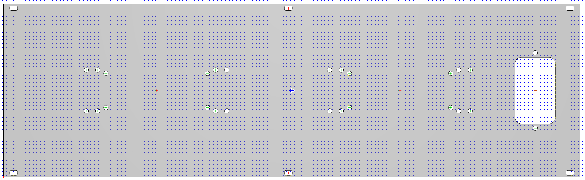
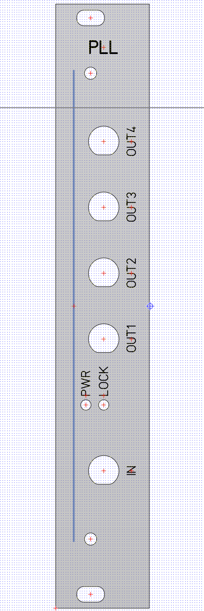
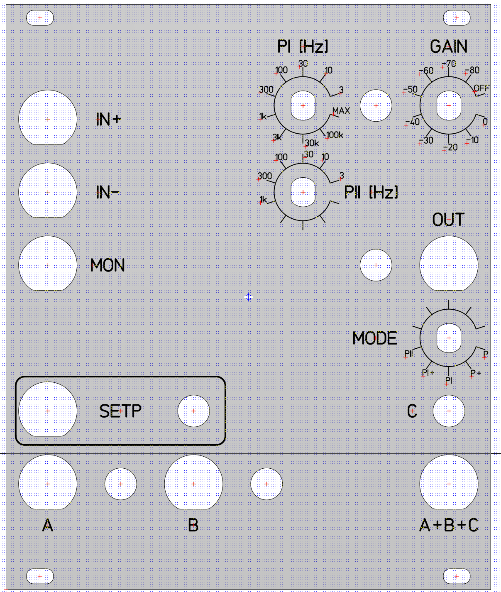
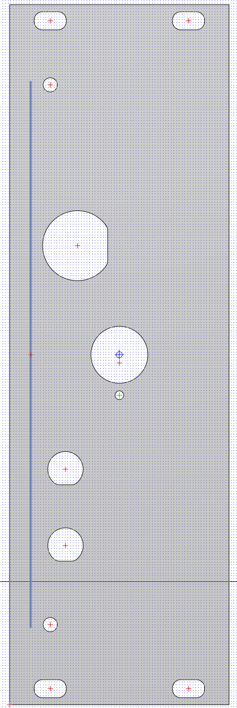
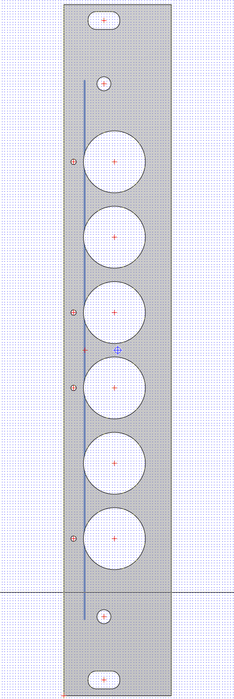
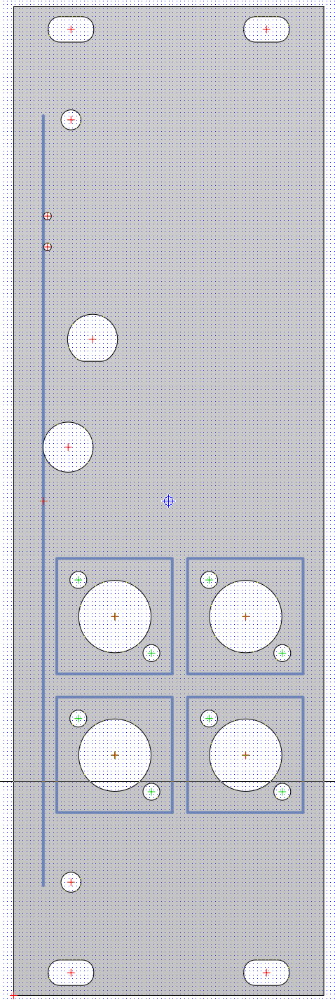
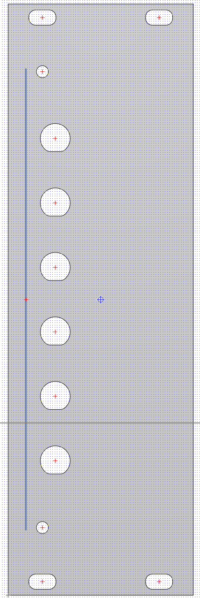

# FrontPanels
3U front panels for [LaserRackBoards](https://github.com/LaserRackBoards). Designed with [Schaeffer](https://www.schaeffer-ag.de/en/) front panel designer.

## Back panel 2023-11

3U 84HP back panel for Schroff subrack with cutout for Schurter DD12-series AC-entry connector/line-filter and mounting holes for XP Power EML-series AC/DC power supplies.

## PLL panel

3U 4HP panel for [PLL-board](https://github.com/LaserRackBoards/PLL). SMA-in, 4pcs SMA-out, 2-LED indicator.

## PII panel

[PII analog servo](https://github.com/LaserRackBoards/PII_Servo) panel.

## VCO and Attenuator panel

For [Attenuator](https://github.com/LaserRackBoards/Attenuator) or [VCO](https://github.com/LaserRackBoards/VCO).

8HP, BNC-input for tuning voltage. 10-turn potentiometer for set-point. 2pcs SMA connectors for RF.

## Vreg panel

4HP, [voltage regulator board](https://github.com/LaserRackBoards/VoltageRegulator) panel with 6pcs Cliff 4mm banana jack.

## Shutter panel

8HP [MEMS shutter](https://github.com/LaserRackBoards/MEMS_Shutter) panel. SMA-input and switch for control. Mounting holes for 4pcs FC/FC fiber couplers.

## SMA panel

8HP generic panel with 6pcs SMA connectors.

